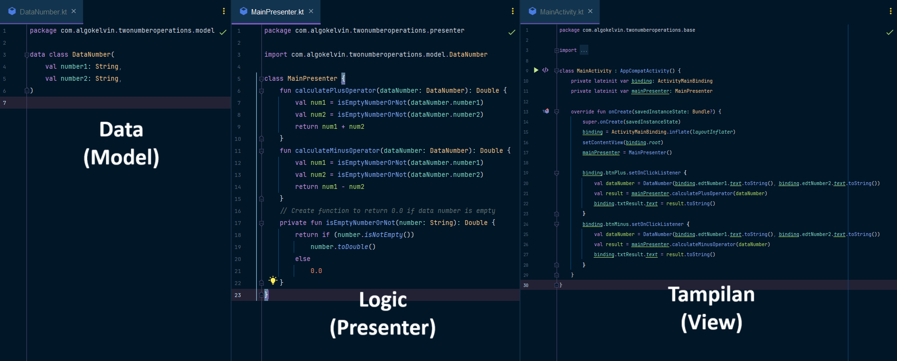

## Two Number Operator With DTL (Data Tampilan Logic)

Aplikasi Android sederhana untuk menghitung 2 angka - Mengimplementasi DTL (Data Tampilan Logic)

|  |  |  |
|:-------------------------------------------------------:|:-------------------------------------------------------:|:-------------------------------------------------------:|
|              Gambar 1: <br> Halaman Utama               |           Gambar 2: <br> Operator Perjumlahan           |           Gambar 3: <br> Operator Pengurangan           |

This is an implementation Two Number Operator's Project with DTL


## Environment
- **Android Gradle**: 8.5.0
- **Plugins Version**: 8.7
- **Gradle Version**: 8.0
- **Java JDK**: 17
- **Kotlin Version**: 1.9.0
- **Min SDK**: 21
- **Target SDK**: 34

## Contributors
Thanks all contributors for build this repository

```
Copyright [2021] [The Dictionary of Android Projects]

   Licensed under the Apache License, Version 2.0 (the "License");
   you may not use this file except in compliance with the License.
   You may obtain a copy of the License at

       http://www.apache.org/licenses/LICENSE-2.0

   Unless required by applicable law or agreed to in writing, software
   distributed under the License is distributed on an "AS IS" BASIS,
   WITHOUT WARRANTIES OR CONDITIONS OF ANY KIND, either express or implied.
   See the License for the specific language governing permissions and
   limitations under the License.
   
```   
